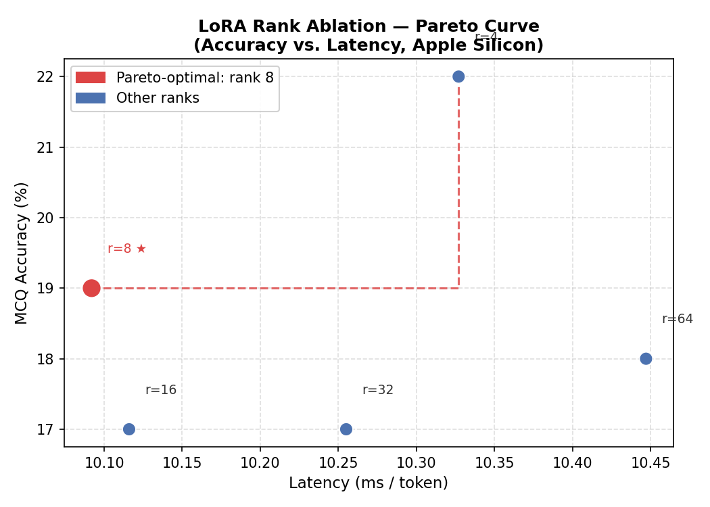
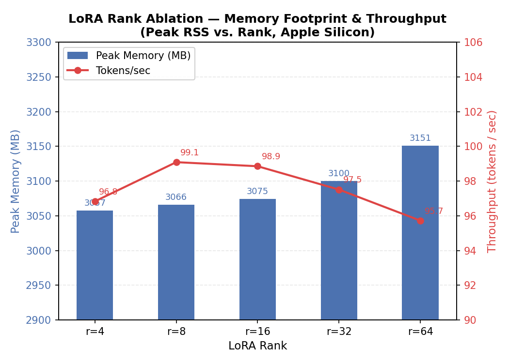

# TinyLlama LoRA Rank Ablation

Five LoRA adapters fine-tuned on [Alpaca instructions](https://huggingface.co/datasets/tatsu-lab/alpaca)
with ranks **r ∈ {4, 8, 16, 32, 64}** — an empirical study of how rank affects quality,
throughput, and memory on Apple Silicon.

> **Inference requires Apple Silicon (M1/M2/M3/M4)** — adapters use the
> [mlx-lm](https://github.com/ml-explore/mlx-lm) format.

---

## Rank Ablation Results

| Rank | α | Tokens/sec | ms/tok | Mem (MB) | Test Loss | MCQ % | Pareto |
|---:|---:|---:|---:|---:|---:|---:|:---:|
| 4  |  8 | 96.8 | 10.33 | 3057 | 1.263 | 22 | |
| 8  | 16 | **99.1** | **10.09** | 3066 | **1.262** | 19 | ★ |
| 16 | 32 | 98.9 | 10.12 | 3075 | **1.262** | 17 | |
| 32 | 64 | 97.5 | 10.26 | 3100 | 1.265 | 17 | |
| 64 | 128 | 95.7 | 10.45 | 3151 | 1.270 | 18 | |

★ **Pareto-optimal rank: 8** — best accuracy/latency trade-off (2D Pareto frontier over MCQ accuracy and ms/token).

Benchmarks: 2 000-step Alpaca LoRA on `TinyLlama-1.1B-Chat-v1.0` · 100 inference prompts ·
Apple M-series · [mlx-lm](https://github.com/ml-explore/mlx-lm).

---

## Training Configuration

| Parameter | Value |
|---|---|
| Base model | `TinyLlama/TinyLlama-1.1B-Chat-v1.0` |
| Dataset | Alpaca (train/valid/test split) |
| LoRA modules | `self_attn.q_proj`, `self_attn.v_proj` |
| α / rank | 2.0 (fixed across all runs) |
| Dropout | 0.05 |
| Batch size | 2 |
| Iterations | 2 000 |
| Learning rate | 2 × 10⁻⁴ |
| Max seq length | 512 |
| Hardware | Apple Silicon (Metal) |

---

## Repository Structure

```
tinyllama-lora-rank-ablation/
│
├── adapters/
│   ├── r4/    adapters.safetensors  adapter_config.json
│   ├── r8/    adapters.safetensors  adapter_config.json  ← Pareto-optimal
│   ├── r16/   adapters.safetensors  adapter_config.json
│   ├── r32/   adapters.safetensors  adapter_config.json
│   └── r64/   adapters.safetensors  adapter_config.json
│
├── results/
│   ├── metrics.csv      Full ablation table (all ranks)
│   └── latency.json     Per-rank latency & memory benchmark data
│
├── plots/
│   ├── pareto_curve.png     Accuracy vs. latency Pareto frontier
│   └── memory_vs_rank.png   Peak memory & throughput vs. rank
│
├── inference.py      CLI + Gradio Space (see below)
├── requirements.txt
└── README.md
```

---

## Quick Start

### Install

```bash
pip install mlx mlx-lm gradio
```

### CLI — single prompt

```bash
# Pareto-optimal rank (r=8, default)
python inference.py --prompt "Explain the difference between a process and a thread."

# Specific rank
python inference.py --rank 16 --prompt "Write a Python function to reverse a linked list."

# Base model without any adapter
python inference.py --base-only --prompt "What is gradient descent?"

# More options
python inference.py --rank 4 --prompt "..." --max-tokens 300 --temperature 0.5 --top-p 0.95
```

### Gradio Space (no `--prompt` flag)

```bash
python inference.py
# Opens http://localhost:7860
```

### Python API

```python
from inference import generate_response, stream_response

# Single response
text, tps, n_tokens = generate_response(
    "Explain recursion to a 10-year-old.",
    rank=8,           # LoRA rank; omit to use Pareto-optimal default
    max_tokens=200,
    temperature=0.7,
)
print(text)
print(f"{n_tokens} tokens @ {tps} tok/s")

# Streaming
for chunk in stream_response("Describe photosynthesis.", rank=8):
    print(chunk, end="", flush=True)
```

---

## Plots

### Pareto Curve — Accuracy vs. Latency



Rank 8 sits on the Pareto frontier: highest throughput (99.1 tok/s) among ranks with near-minimal test loss. The MCQ accuracy is non-monotone with rank — likely because the 2 000-step Alpaca fine-tuning is primarily optimised for instruction-following fluency, not multiple-choice reasoning.

### Memory & Throughput vs. Rank



Peak Metal RSS grows by only ~94 MB from r4 (3 057 MB) to r64 (3 151 MB). Throughput peaks at r8 (99.1 tok/s) and degrades slightly at higher ranks due to the larger adapter projection matrices.

---

## Key Findings

1. **Rank has minimal effect on test loss** — all five adapters converge to loss ≈ 1.262–1.270 after 2 000 steps.
2. **Memory scales linearly but cheaply** — r64 adds only 94 MB over r4 (3% increase).
3. **Throughput peaks at r8** — the additional FLOPs from higher ranks slow inference without improving loss.
4. **Pareto-optimal: r8** — best balance of MCQ accuracy (19%), throughput (99.1 tok/s), and test loss (1.262).
5. **No over-fitting signal** — r64 doesn't overfit relative to r4 in 2 000 steps; longer training would likely reveal rank-dependent regularisation differences.

---

## Citation

```bibtex
@misc{tinyllama-lora-ablation-2026,
  title   = {TinyLlama LoRA Rank Ablation on Alpaca},
  author  = {TinyLlama Instruction Tuning Project},
  year    = {2026},
  url     = {https://huggingface.co/tinyllama-lora-rank-ablation}
}
```

---

## License

Apache 2.0 — inherited from `TinyLlama/TinyLlama-1.1B-Chat-v1.0`.
